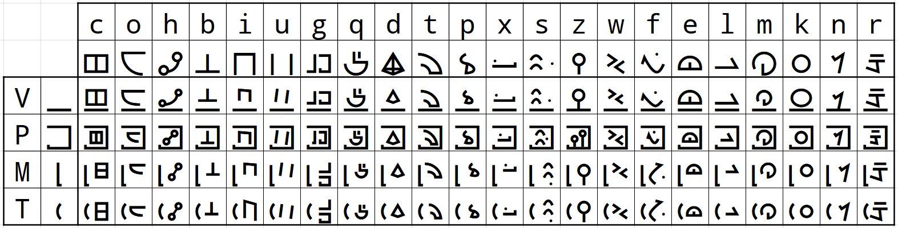

# Devotee Plus

This is a font for the Devotee language in the game [Chants of Sennaar](https://www.focus-entmt.com/en/games/chants-of-sennaar). It contains all in-game glyphs, as well as all combinations of the "radicals".

## Glyph table

Besides the glyphs above, you can use space (` `) for space (duh), and use hyphen (`-`) for keep the characters from combining with the previous one. 

## Example texts

